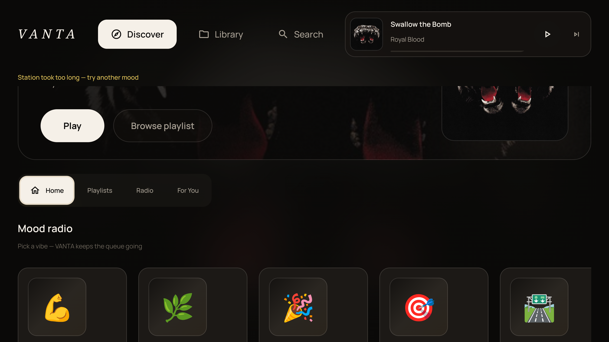
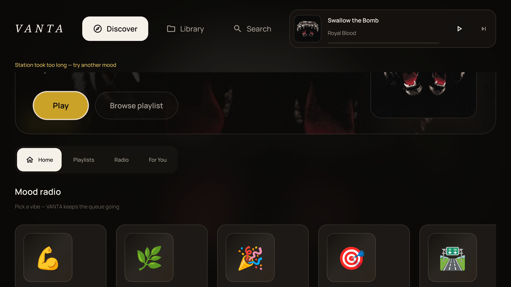
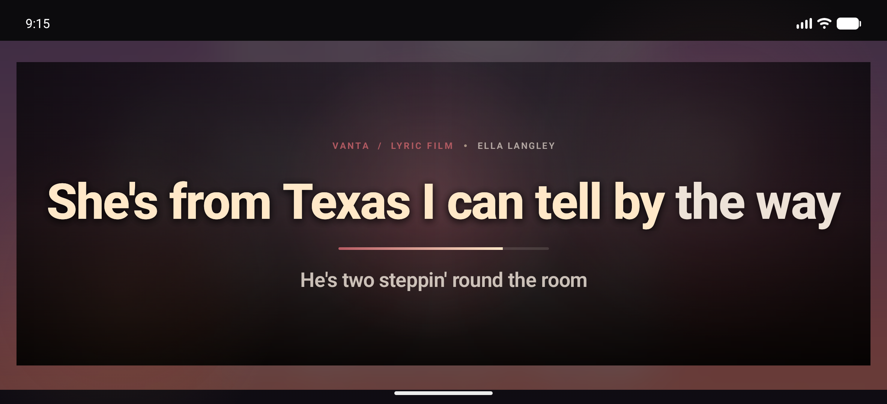
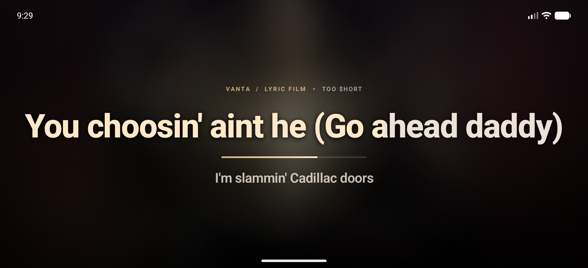
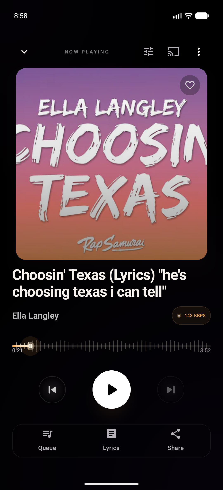
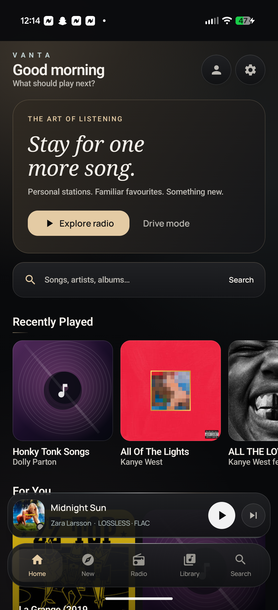

<div align="center">

# 🌌 VANTA
### Audiophile Hi-Res Lossless & Dolby Atmos Spatial Music Player

[](https://github.com/drewk312/VantaMusic)
[](https://github.com/drewk312/VantaMusic)
[](https://github.com/drewk312/VantaMusic)
[](https://github.com/drewk312/VantaMusic)
[](https://github.com/drewk312/VantaMusic)
[](https://ko-fi.com/drewk312)
[](https://discord.gg/7P5erYcx2x)

<p align="center">
  <b>VANTA</b> is a high-performance Android music player engineered for audiophiles who demand uncompromised sound fidelity, true Dolby Atmos 7.1.4 binaural spatial rendering, and studio-grade DSP on their headphones and speakers.
</p>

[📥 Download Latest APK](#-download--install) • [✨ Key Features](#-features) • [📸 Screenshots](#-multi-device-showcase) • [🗺️ Roadmap](#-roadmap--upcoming) • [🛡️ Security & Privacy](#-security--privacy) • [🤝 Thanks](#-special-thanks) • [☕ Support](#-support-the-project)

---

</div>

## 📸 Multi-Device Showcase

### 📺 Android TV & 10-Foot Jukebox Theater
<p align="center">
  
  &nbsp;
  
</p>

### 🚐 RV, In-Car & Landscape Cockpit
<p align="center">
  
  &nbsp;
  
</p>

### 📱 Mobile AMOLED Luxury Interface
<p align="center">
  
  &nbsp;&nbsp;&nbsp;&nbsp;
  
</p>

---

## ✨ Features

### 🎧 Custom Binaural HRTF Spatial Audio Engine
* **Physical 7.1.4 Speaker Simulation**: Decodes multi-channel spatial streams into physical 3D coordinates (CICP 19 standard: Left, Right, Center, LFE Sub, Surround, Back, and 4 Height/Overhead channels).
* **Valve Steam Audio Acoustic Pipeline**: Uses high-resolution Head-Related Transfer Functions (HRTF) to reconstruct a lifelike, three-dimensional acoustic space in any pair of standard headphones.
* **Punchy LFE & High-Frequency Air**: Custom analog-modeled saturation limiter, dedicated subwoofer boost, and a +2.2 dB high-frequency presence filter eliminate the "muffled/quiet" veil common to virtual spatial decoders.

### 💎 Bit-Perfect 32-bit Lossless Playback
* Direct high-resolution output engine bypassing standard Android 48 kHz mixer resampling.
* Native decoding for 24-bit/192kHz FLAC, ALAC, WAV, and immersive spatial formats.

### 🎚️ Smart Sound Check (Volume Normalization)
* Tired of quiet Atmos masters followed by ear-shattering stereo FLAC tracks?
* VANTA's intelligent format-aware Sound Check levels perceived loudness across albums and playlists, giving Atmos tracks proper headroom while attenuating overly aggressive stereo limiters.

### 🎛️ Studio-Grade JamesDSP Suite
* **15-Band Parametric Equalizer**: Fine-tune specific frequencies with surgical precision.
* **AutoEQ Database Integration**: One-tap frequency compensation profiles for over 5,000+ headphone models.
* **Analog Tube Drive & Limiter**: Add warm harmonic saturation without digital clipping.

### 🌌 Luxury AMOLED Dark Interface
* **Spotify-Style Canvas Visual Mode**: Immersive full-screen animated motion artwork with audio-reactive bass pumping, cinematic camera drift, and ambient luminous particles.
* **Intelligent Queue Forming**: Tapping any single song automatically forms a curated "Up Next" queue so your music never abruptly stops.
* **Instant Shuffle**: Dedicated shuffle toggle right in the player transport controls and player overflow menu.
* **Smart Search Engine**: Multi-word artist + song title parsing and intelligent candidate scoring to guarantee exact tracks display immediately without missing matches.
* Adaptive real-time color extraction from album artwork.
* Smooth, high-refresh-rate Compose UI optimized for one-handed operation, foldables, and tablets.
* Synchronized dynamic lyrics support.

### 📺 Android TV & RV Camper Theater
* **10-Foot Leanback Interface**: Dedicated TV experience tailored for D-pad remotes (Google TV, Fire TV, Nvidia Shield) with ambient audio reactive glow.
* **RV & In-Car Landscape Cockpit**: Responsive panoramic mode with prominent transport buttons, high-visibility track metadata, and large touch targets for automotive and RV mounts.
* **Cinematic Jukebox Lyrics**: Immersive line-by-line synced lyrics stage turning your television or tablet into a living room jukebox.

### 🔄 In-App Seamless Updating
* Built-in Over-The-Air (OTA) updater automatically checks for the latest releases with single-tap installation.

---

## 🗺️ Roadmap & Upcoming

* 🔍 **Spotify-Style Lyrics Match Search**: Search songs instantly by typing lines or fragments of lyrics when you can't recall the title or artist name.
* 🎧 **Expanded AutoEQ Profiles**: Ongoing additions for newly released planar magnetic and IEM headphone target curves.
* ⚡ **Advanced Native C++ Audio Optimizations**: Further reducing latency and memory usage on multi-channel spatial streams.

---

## 📥 Download & Install

You can download the latest official release APK directly from our GitHub Releases page:

👉 **[Download VANTA v1.05 (Latest Release)](https://github.com/drewk312/VantaMusic/releases/latest)**

### Installation Instructions:
1. Download `vanta.apk` from the link above or the **Releases** tab.
2. Tap the downloaded file on your Android device.
3. If prompted, allow *"Install from unknown sources"* in your browser or file manager settings.
4. Enjoy your music in bit-perfect spatial clarity!

> **System Requirements**: Android 8.0 (Oreo) or newer. Works with any wired or wireless (Bluetooth LDAC / aptX HD) headphones.

---

## 🛡️ Security & Privacy

VANTA is completely free, non-commercial software built by audio enthusiasts with privacy and sound fidelity as our top priorities:

* **Zero Advertisements**: No banner ads, interstitial popups, or sponsored media.
* **Zero User Trackers**: No third-party telemetry, behavioral tracking, or data harvesting.
* **100% VirusTotal Clean**: Scanned across 70+ top antivirus engines with zero detections.
  * 🔗 **[View Official VirusTotal Analysis Report](https://www.virustotal.com/gui/file/ca7a8628e69c6f5af7062318a840b12ddddfc49ee2ee57e9c2b81db82c989542?nocache=1)** *(0 / 72 detections)*
* **Release Binary Integrity Check (SHA-256)**:
  ```text
  1D808628A0BA2AF3EB2029E34D8CBE72E0BD4F5AAA7EE090CC04E20D467581C7
  ```

---

## ☕ Support the Project

VANTA is independently built and maintained without venture capital, subscriptions, or ads. If you enjoy the app and want to support ongoing DSP development, server hosting, and new features:

<div align="center">

[](https://ko-fi.com/drewk312)

**[ko-fi.com/drewk312](https://ko-fi.com/drewk312)**

</div>

---

## 💬 Community & Bug Reports

Join the official Discord to chat with the developer, request features, and hang out with other audiophiles!
👉 **[Join VANTA HQ on Discord](https://discord.gg/7P5erYcx2x)**

Have a feature request, question, or found a bug?
* Submit an issue on the **[Issues Tab](https://github.com/drewk312/VantaMusic/issues)**.
* Check out our release changelogs in the **[Releases](https://github.com/drewk312/VantaMusic/releases)** section.

---

## 🤝 Special Thanks

Huge thanks to everyone who supported this project along the way:

* **Inzo184** (`@inzo1848842`)
* **Ink & Echo Admin** (`@developerbios`)
* **Riknar** (`@riknarr`)
* *...and to everyone in the community supporting the player!*
