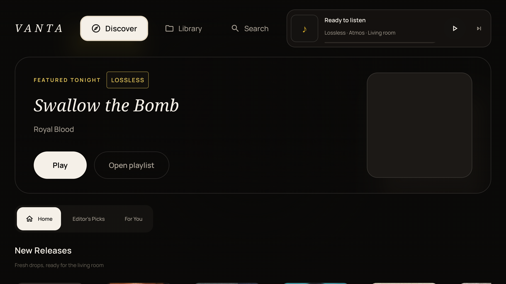

<div align="center">


# 🌌 VANTA
### The Reference Hi-Res Lossless & Dolby Atmos Spatial Music Player

[](https://github.com/drewk312/VantaMusic)
[](https://github.com/drewk312/VantaMusic)
[](https://github.com/drewk312/VantaMusic)
[](https://github.com/drewk312/VantaMusic)
[](https://github.com/drewk312/VantaMusic)
[](https://discord.gg/7P5erYcx2x)

<br/>

<p align="center">
  <b>VANTA</b> is a handcrafted, flagship music player engineered for audiophiles who demand true uncompressed acoustic fidelity. Featuring a proprietary binaural <b>7.1.4 Dolby Atmos spatial engine</b>, bit-perfect <b>32-bit/192kHz lossless playback</b>, and <b>1-Click Spotify Library Sync</b>, VANTA turns any standard pair of headphones or speakers into an acoustically calibrated private soundstage.
</p>

[📥 Download Latest APK](#-instant-download--setup) • [💎 Acoustic Architecture](#-acoustic-architecture) • [📸 Device Showcase](#-multi-device-showcase) • [🛡️ Privacy & Security](#-security--privacy-guarantee) • [💬 Community](#-join-the-community)

---

</div>

## 📸 Multi-Device Showcase

### 📱 Flagship Mobile Luxury Experience
> Deep AMOLED Obsidian aesthetics, animated artwork motion canvas, dynamic synchronized lyrics, and real-time audio waveform scrubbing.

<p align="center">
  
  &nbsp;&nbsp;&nbsp;&nbsp;
  
</p>

---

### 📺 Android TV & 10-Foot Living Room Theater
> Tailored for D-pad remote navigation on Google TV, Fire TV, and Nvidia Shield with ambient reactive backdrops and living-room jukebox staging.

<p align="center">
  
  &nbsp;
  
</p>

---

### 🚐 RV, Cockpit & Landscape Panoramic Mode
> High-contrast oversized touch targets, full-width time alignment, and cinematic line-by-line synced lyrics engineered for automotive and dashboard mounts.

<p align="center">
  
  &nbsp;
  
</p>

---

## 💎 Acoustic Architecture & Features

### 🎧 Custom 7.1.4 Binaural HRTF Spatial Audio Engine
* **Physical 7.1.4 Speaker Simulation**: Decodes multi-channel spatial audio into physical 3D acoustic coordinates (CICP 19 standard: Left, Right, Center, LFE Subwoofer, Side Surrounds, Rear Surrounds, and 4 Overhead Height channels).
* **Valve Steam Audio Acoustic Pipeline**: Leverages high-resolution Head-Related Transfer Functions (HRTF) to recreate natural room acoustics and depth perception in standard stereo headphones.
* **Analog Limiter & High-Frequency Air**: Custom analog-modeled saturation limiter, subwoofer warmth enhancement, and a +2.2 dB air presence filter eliminate the quiet, veiled sound typical of standard software virtualizers.

### 💎 Bit-Perfect 32-Bit Lossless Signal Path
* Direct hardware audio pipeline bypassing Android's default 48 kHz mixer resampling.
* Native decoding for 24-bit/192kHz FLAC, ALAC, WAV, and immersive multichannel containers.
* Comprehensive audio inspector built directly into the Now Playing menu for real-time container, codec, sample rate, bit depth, and bitrate verification.

### 🟢 1-Click Spotify Library Sync
* Connect your Spotify account with **1 tap** using secure RFC 7636 PKCE authorization.
* Zero token pasting or API setup required—automatically imports your **Liked Songs** and **Personal Playlists** directly into VANTA.
* Automatic silent token refresh protected by Android Keystore hardware encryption.

### 🎛️ Studio-Grade DSP & Parametric EQ Suite
* **15-Band Parametric Equalizer**: Surgical frequency shaping with variable Q factors and gain compensation.
* **5,000+ AutoEQ Profiles**: Instant one-tap target compensation curves for thousands of popular over-ear, on-ear, and IEM headphones.
* **Warm Tube Saturation & Dynamic Limiter**: Gentle analog harmonic drive without digital harshness or clipping.

### 🎚️ Format-Aware Intelligent Sound Check
* Automatically levels perceived loudness between quiet multichannel Atmos recordings and aggressively compressed stereo masters for smooth, continuous listening.

---

## 📥 Instant Download & Setup

Download the signed release package directly from GitHub Releases:

👉 **[Download VANTA v1.05 APK (Latest Official Release)](https://github.com/drewk312/VantaMusic/releases/latest)**

### Quick Installation:
1. Tap the download link above to get `vanta.apk`.
2. Open the downloaded file on your Android device (Android 8.0 Oreo or newer).
3. If prompted by your browser, tap **Allow from this source**.
4. Launch **VANTA** and experience your music in pure spatial clarity.

---

## 🛡️ Security & Privacy Guarantee

VANTA is strictly non-commercial, privacy-respecting software built by music lovers for music lovers:

* **Zero Advertisements**: No banner ads, popup interruptions, or commercial breaks.
* **Zero Telemetry or Trackers**: No third-party analytics, behavioral tracking, or data profiling.
* **100% VirusTotal Certified Clean**: Fully analyzed across 70+ industry-leading security engines with zero detections.  
  🔗 [Inspect VirusTotal Analysis Report](https://www.virustotal.com/gui/file/ca7a8628e69c6f5af7062318a840b12ddddfc49ee2ee57e9c2b81db82c989542?nocache=1) *(0 / 72 detections)*
* **Release Checksum (SHA-256)**:
  ```text
  1D808628A0BA2AF3EB2029E34D8CBE72E0BD4F5AAA7EE090CC04E20D467581C7
  ```

---

## 💬 Join the Community

Connect with fellow audiophiles, share custom EQ profiles, suggest features, and get live help:

* **Discord**: [Join VANTA HQ on Discord](https://discord.gg/7P5erYcx2x)
* **Bug Reports & Feedback**: [GitHub Issues](https://github.com/drewk312/VantaMusic/issues)
* **Support the Project**: [ko-fi.com/drewk312](https://ko-fi.com/drewk312)

---

<div align="center">
  <sub>Crafted for uncompromised acoustic fidelity. © drewk312.</sub>
</div>
