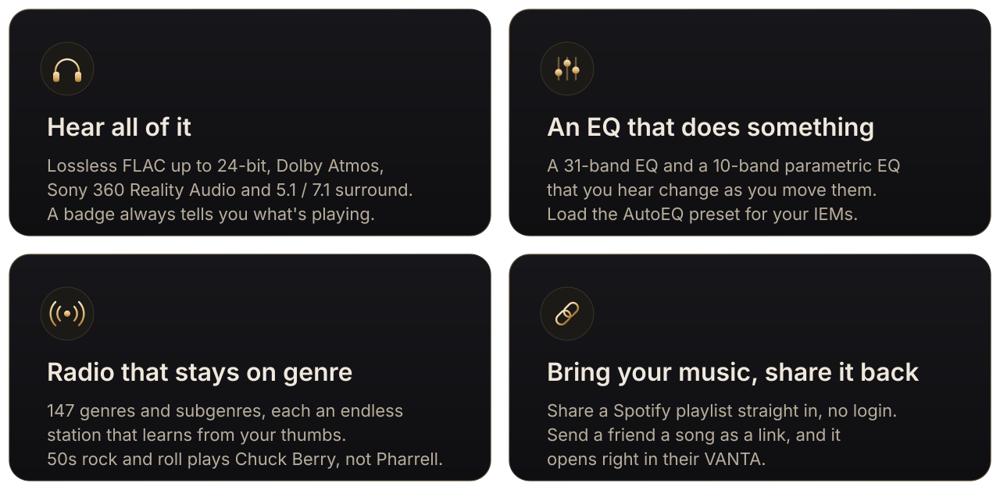
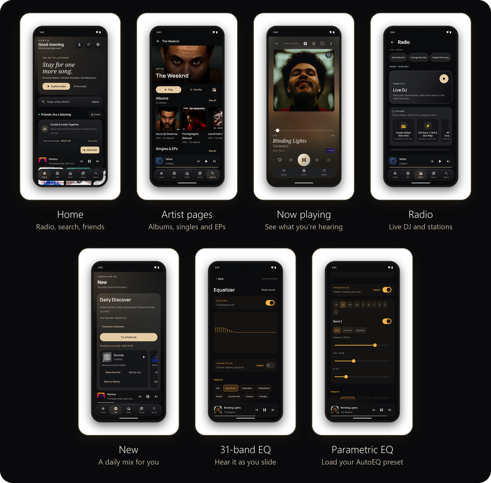
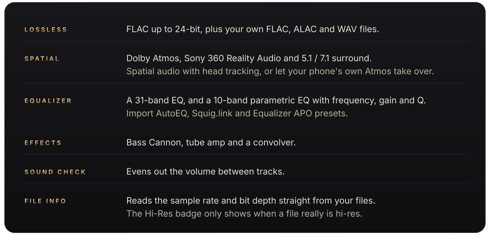
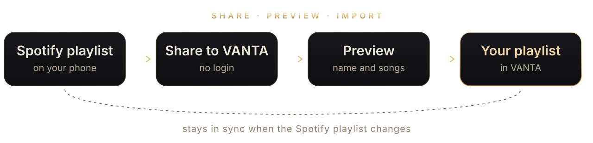
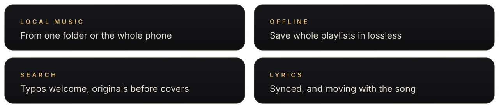
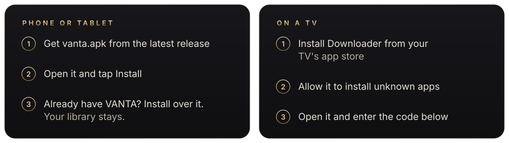

<a href="https://github.com/drewk312/VantaMusic/releases/latest">
  <picture>
    <source media="(prefers-color-scheme: dark)" srcset="./assets/banner-dark.svg" />
    <source media="(prefers-color-scheme: light)" srcset="./assets/banner-light.svg" />
    
  </picture>
</a>

<a href="https://github.com/drewk312/VantaMusic/releases/latest">
  <picture>
    <source media="(prefers-color-scheme: dark)" srcset="./assets/cta-dark.svg" />
    <source media="(prefers-color-scheme: light)" srcset="./assets/cta-light.svg" />
    
  </picture>
</a>

<a href="#why-vanta">Features</a> &nbsp;&nbsp;·&nbsp;&nbsp; <a href="#sound">Sound</a> &nbsp;&nbsp;·&nbsp;&nbsp; <a href="#install">Install</a> &nbsp;&nbsp;·&nbsp;&nbsp; <a href="#faq">Questions</a> &nbsp;&nbsp;·&nbsp;&nbsp; <a href="https://discord.gg/vN6ztK6m6g">Discord</a>

  

 

<i>I build VANTA on my own, in my spare time. I wanted a player that plays lossless and Dolby Atmos properly, has an EQ that actually does something, and does radio that stays on the genre you picked. So I made one.</i>

 

<picture><source media="(prefers-color-scheme: dark)" srcset="./assets/h-why-dark.svg" /><source media="(prefers-color-scheme: light)" srcset="./assets/h-why-light.svg" /></picture>

 

<picture><source media="(prefers-color-scheme: dark)" srcset="./assets/h-screens-dark.svg" /><source media="(prefers-color-scheme: light)" srcset="./assets/h-screens-light.svg" /></picture>

 

<picture><source media="(prefers-color-scheme: dark)" srcset="./assets/h-sound-dark.svg" /><source media="(prefers-color-scheme: light)" srcset="./assets/h-sound-light.svg" /></picture>

<i>Put your headphones on for this part.</i>

 

<picture><source media="(prefers-color-scheme: dark)" srcset="./assets/h-music-dark.svg" /><source media="(prefers-color-scheme: light)" srcset="./assets/h-music-light.svg" /></picture>

In Spotify, tap <kbd>Share</kbd> on a playlist and pick <kbd>VANTA</kbd>, or paste the link into VANTA's Imports screen.

Spotify only gives out the first 100 songs of a playlist through a shared link. For bigger playlists or your Liked Songs, export them as a CSV and import that instead. There's no size limit that way, and each song keeps its exact recording.

 

<picture><source media="(prefers-color-scheme: dark)" srcset="./assets/h-beyond-dark.svg" /><source media="(prefers-color-scheme: light)" srcset="./assets/h-beyond-light.svg" /></picture>

<i>A layout built for the remote on Android TV, and a landscape mode for car and RV dash mounts.</i>

 

<picture><source media="(prefers-color-scheme: dark)" srcset="./assets/h-install-dark.svg" /><source media="(prefers-color-scheme: light)" srcset="./assets/h-install-light.svg" /></picture>

Fire TV should work on Fire OS 7 or newer. VANTA is only released on this repo's <a href="https://github.com/drewk312/VantaMusic/releases">Releases page</a> (<a href="SECURITY.md">how to check a download</a>).

 

<picture><source media="(prefers-color-scheme: dark)" srcset="./assets/h-faq-dark.svg" /><source media="(prefers-color-scheme: light)" srcset="./assets/h-faq-light.svg" /></picture>

<b>Is it really free?</b>

 
Yes. There are no ads, no subscription and nothing to unlock. If you want to support it, there's <a href="https://ko-fi.com/drewk312">Ko-fi</a>, but you never have to.

<b>Why isn't it on the Play Store?</b>

 
For now it's released here on GitHub. The in-app updater tells you when a new version is out, and installing it keeps your library.

<b>Does the EQ work with my USB DAC or dongle?</b>

 
It should. Headphones, Bluetooth and USB DACs get the full EQ and effects, and only the phone's built-in speaker gets a gentler profile so it doesn't distort. I haven't tested every DAC, so if the EQ does nothing on yours, tell me which one on <a href="https://discord.gg/vN6ztK6m6g">Discord</a>.

<b>How do I use my AutoEQ preset?</b>

 
Open the EQ, turn on the parametric EQ and tap <kbd>Import</kbd>. Pick the <code>ParametricEQ.txt</code> file for your headphones from AutoEQ, or an export from Squig.link or Equalizer APO.

<b>Where do I report a bug?</b>

 
On <a href="https://discord.gg/vN6ztK6m6g">Discord</a> or in <a href="https://github.com/drewk312/VantaMusic/issues">GitHub Issues</a>. Tell me your phone model, what you did and what happened. A screenshot helps a lot.

<b>Is the source code available?</b>

 
No. This repo is for releases and news, and the app's source is private.

 

VANTA is made by one person. If it's earned a spot on your phone, a coffee helps keep it going.

<a href="https://discord.gg/vN6ztK6m6g">Discord</a> &nbsp;·&nbsp; <a href="https://github.com/drewk312/VantaMusic/issues">Report a bug</a> &nbsp;·&nbsp; <a href="#readme">Back to top</a>

Shoutouts to Inzo184 (<code>@inzo1848842</code>), Ink &amp; Echo Admin (<code>@developerbios</code>) and Riknar (<code>@riknarr</code>).

 

VANTA is an independent, non-commercial project. It isn't affiliated with or endorsed by Spotify, Apple, Google, Dolby, Sony, or any label, artist or streaming service; their names are only used to describe compatibility. VANTA doesn't host, store, sell or distribute music. You're responsible for how you use it and for following the terms of any service you connect. If you love an artist, support them by buying their music, streaming it officially, and going to their shows.  
VANTA is provided as is, with no warranty.  
Copyright © drewk312. The VANTA name, logo and branding may not be reused, and unofficial copies must not present themselves as official releases. Official releases are only published on this repository's [Releases page](https://github.com/drewk312/VantaMusic/releases). VANTA includes open-source components under their own licenses. Dolby, Dolby Atmos, Sony 360 Reality Audio, Spotify and other trademarks belong to their owners. Album art in the screenshots belongs to its owners.
