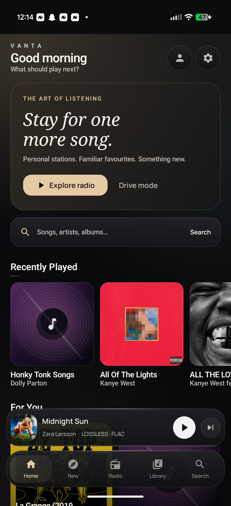

# V A N T A

### Stay for one more song.

A music-first experience. Deep blacks. Warm gold. Room to listen.

**ANDROID · BIG-SCREEN LISTENING · LYRICS · PERSONAL AUDIO**

[Explore the app](#a-closer-look) · [Releases](https://github.com/drewk312/VantaMusic/releases) · [Join the community](https://discord.gg/7P5erYcx2x) · [Report a bug](https://github.com/drewk312/VantaMusic/issues)

---

## Your music. Its own space.

VANTA brings artwork, your library, and playback controls into a dark, uncluttered listening experience. From a pair of headphones to a living-room screen, the focus stays on the music.

| Find your next listen | Make it yours | Take the bigger view |
| :--- | :--- | :--- |
| Library, search, radio, and recently played in one place. | Audio controls and a player built around artwork, queue, and lyrics. | Dedicated TV and landscape layouts with more room for your music. |

## A closer look

### In your hand

A warm, album-led home screen. A full-screen player that gives the artwork room to breathe.

&nbsp;

### In your living room

A dedicated TV interface with prominent navigation, large controls, and a layout made for viewing across the room.

### Give the lyrics the screen

Landscape lyric views turn a wider display into a focused listening space. Use visual features only when it is safe to do so—not while driving.

Images show existing VANTA interface captures. Appearance and feature availability can vary by build and device.

## Built around listening

- **An album-first player** — prominent artwork, playback controls, queue access, and lyrics.
- **A home for your library** — browse music, revisit recent listens, and explore radio.
- **Audio tools to explore** — equalizer and spatial-audio controls are part of the app's audio work; behavior depends on the build, device, and output route.
- **More than a phone layout** — dedicated TV navigation and immersive landscape views.
- **Community-shaped development** — real device reports help prioritize the next improvements.

### What we're improving

Playback startup and seeking, Spotify connection, CSV matching, phone/TV sync, fullscreen behavior, and audio-effect consistency are active areas of work. These are not being advertised as resolved in a released build.

## Get VANTA

**Android 8.0 or newer.**

> **Release update:** A replacement APK is being prepared and verified. Downloads are temporarily unavailable on this page. The next verified build will be published in Releases with installation guidance and a SHA-256 checksum.

### [Visit official releases →](https://github.com/drewk312/VantaMusic/releases)

You can watch this repository's releases to hear when the next build is available. Only install APKs from the official release page; don't rely on unverified mirrors.

## Help shape the next version

Have a device-specific issue or an idea for a better listening experience? We'd like to hear it.

**[Join VANTA HQ on Discord](https://discord.gg/7P5erYcx2x)** · **[Report a reproducible issue](https://github.com/drewk312/VantaMusic/issues)** · **[Support the project](https://ko-fi.com/drewk312)**

For bug reports, include your app version, Android version, device model, and steps to reproduce. Keep account details, tokens, passwords, and other personal information out of reports and screenshots.

---

**Made for the moments between play and one more song.**

This repository is the public VANTA showcase and release destination—not the application source repository. No signing keys or development credentials are distributed here. See <a href="SECURITY.md">security guidance</a>.

