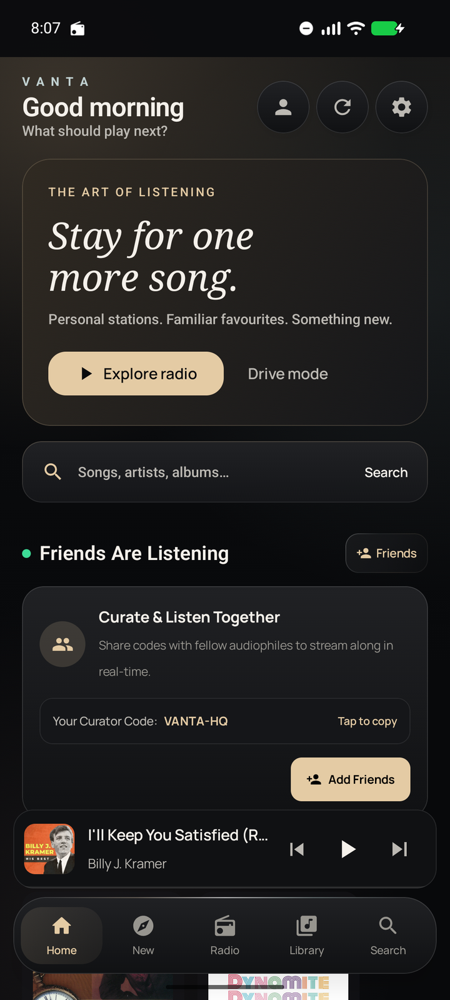
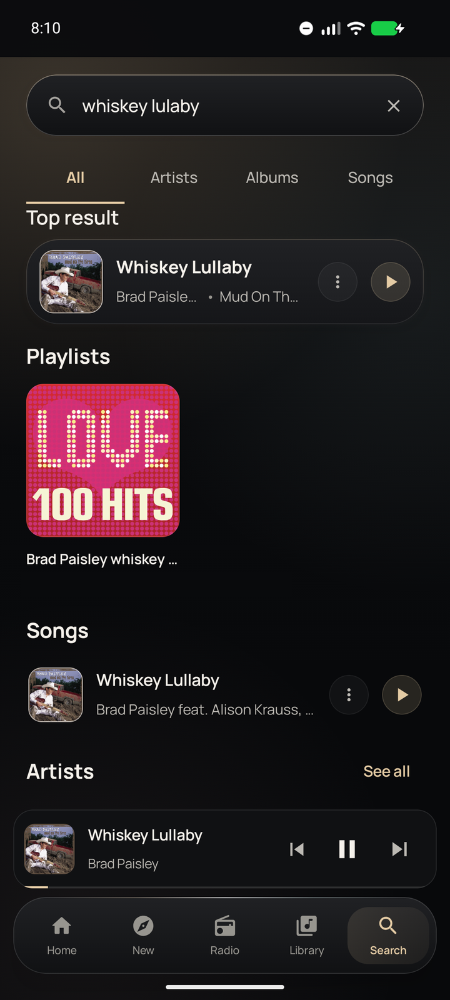
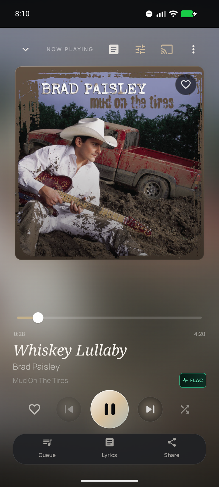
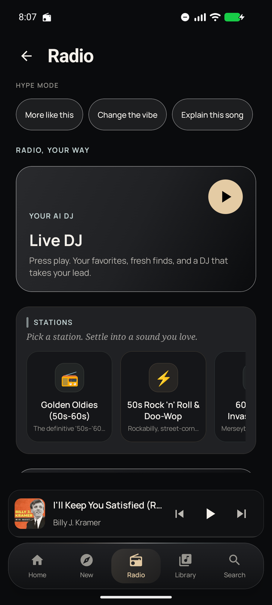
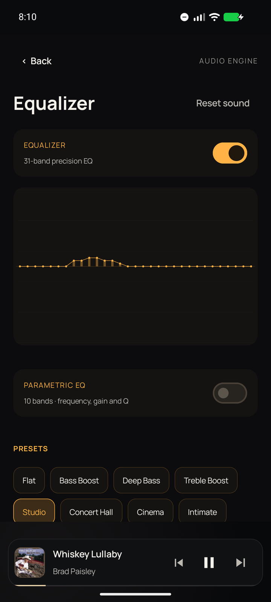
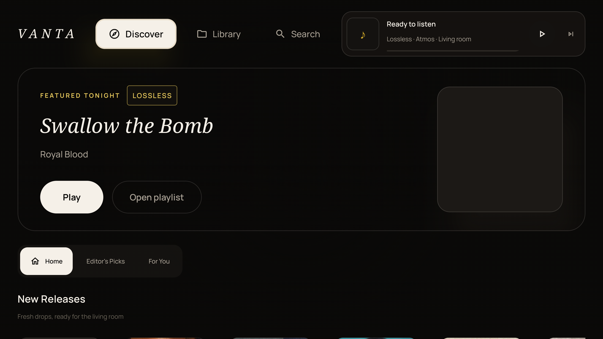

<div align="center">


# 🌌 VANTA
### The Reference Hi-Res Lossless & Dolby Atmos Spatial Music Player

[](https://github.com/drewk312/VantaMusic/releases/latest)
[](#-acoustic-architecture--features)
[](#-acoustic-architecture--features)
[](#-spotify-playlists-no-login-needed)
[](#%EF%B8%8F-security--privacy-guarantee)
[](https://discord.gg/vN6ztK6m6g)
[](https://ko-fi.com/drewk312)

<br/>

<p align="center">
  <b>VANTA</b> is a handcrafted, flagship music player for audiophiles who demand real fidelity. Studio-master <b>24-bit lossless FLAC</b>, <b>Dolby Atmos & Sony 360 immersive playback</b>, a studio-grade <b>DSP & parametric EQ suite</b>, and <b>Spotify playlists with no login</b>, all wrapped in a deep-black, gold-accented design that turns any pair of headphones into your private listening room.
</p>

<a href="https://github.com/drewk312/VantaMusic/releases/latest"></a>

[✨ What's New in 1.00](#-whats-new-in-100) • [💎 Acoustic Architecture](#-acoustic-architecture--features) • [📸 Device Showcase](#-multi-device-showcase) • [🛡️ Privacy & Security](#%EF%B8%8F-security--privacy-guarantee) • [☕ Support](#-support-the-project) • [🤝 Thanks](#-special-thanks)

---

</div>

## ✨ What's New in 1.00

**A fresh start.** We took every bug report and feature wish from the community and worked through them one by one, testing every fix on real builds before it shipped.

* ▶️ **Press play and it plays**: faster starts, skips that always land, albums in order, and seeking that goes where you let go.
* 🔎 **Search that knows what you meant**: typos welcome (*"whiskey lulaby"* finds Brad Paisley & Alison Krauss), and the original always beats the cover.
* 📻 **Endless radio, done properly**: **147 genres & subgenres**, from Yacht Rock to Shoegaze. Stations stay on theme, never loop, and remember your 👍 / 👎.
* 🎚️ **Live EQ + new parametric EQ**: every change is heard instantly, no restarting the song.
* ⬇️ **Offline playlists** in lossless quality.
* 🛠️ **Rock-solid**: big libraries, huge imports, File Info and downloads are all crash-free, with honest quality badges everywhere.

👉 **[Read the full 1.00 release notes](https://github.com/drewk312/VantaMusic/releases/latest)**

---

## 📸 Multi-Device Showcase

### 📱 Flagship Mobile Luxury Experience
> Deep AMOLED obsidian aesthetics, album-first artwork, synced lyrics, live format badges, and a studio-grade equalizer one tap away.

<p align="center">
  
  
  
  
  
</p>

---

### 📺 Android TV & 10-Foot Living Room Theater
> Tailored for D-pad remote navigation on Google TV, Fire TV and Nvidia Shield, with ambient backdrops and living-room jukebox staging. Link your phone and TV with a code.

<p align="center">
  
</p>

---

### 🚐 RV, Cockpit & Landscape Panoramic Mode
> High-contrast oversized touch targets, full-width timing and cinematic line-by-line synced lyrics for dashboard and RV mounts. (Glance only when it's safe. Never while driving.)

<p align="center">
  
</p>

---

## 💎 Acoustic Architecture & Features

### 🎧 Dolby Atmos & Immersive Spatial Audio
* **Dolby Atmos playback**: immersive E-AC-3 JOC mixes and multichannel **5.1 / 7.1 surround**, sent straight to your device's own Atmos engine.
* **Sony 360 Reality Audio** support for 3D object-based mixes.
* **VANTA Immersive Sound with Head Tracking**: headphone spatial modes with crossfeed that turn with your head. Already have Dolby Atmos built into your phone? Let it take over. Your choice.

### 💎 Lossless Signal Path
* Studio-master **24-bit FLAC** streaming, plus native FLAC, ALAC and WAV playback.
* **Float output** and **Auto Headroom** keep loud masters clean and clip-free.
* **USB DAC friendly**: with a DAC connected, VANTA's effects step aside and your DAC gets clean, untouched audio.
* **Built-in audio inspector**: tap *View File Info* to see the real codec, container, sample rate, bit depth and bitrate of what's playing. Badges only say Hi-Res when it truly is.

### 🟢 Spotify Playlists, No Login Needed
* **Share → VANTA.** Share any Spotify playlist (up to **10,000 songs**) or paste its link. No developer keys, no sign-in screens.
* **Auto-sync**: add songs in Spotify and they show up in VANTA automatically.
* **CSV imports** from Exportify, Soundiiz and friends keep each song's exact recording, so you get the version you loved.

### 🎛️ Studio-Grade DSP & Parametric EQ Suite
* **31-Band Graphic EQ** with presets, from Bass Boost to Studio and Concert Hall.
* **10-Band Parametric Equalizer**: surgical shaping with frequency, gain and Q per band.
* **Headphone AutoEQ**: load target compensation curves for your headphones.
* **Tube Amp Simulation, Bass Cannon & Convolver** for warmth, punch and custom room impulses.
* Every change applies **live**, mid-song.

### 🎚️ Format-Aware Sound Check
* Levels perceived loudness between quiet multichannel Atmos mixes and heavily compressed stereo masters for smooth, continuous listening.

### 📻 Endless Radio & AI DJ
* **147 genre & subgenre stations**, each one endless and on theme, with a 24-hour no-repeat and artist spacing.
* **Live DJ** with optional host narration, plus crossfade and Automix transitions.

---

## 📥 Instant Download & Setup

Download the signed release package directly from GitHub Releases:

👉 **[Download VANTA 1.00 APK (Latest Official Release)](https://github.com/drewk312/VantaMusic/releases/latest)**

### Quick Installation:
1. Tap the download link above to get `vanta.apk`.
2. Open the downloaded file on your Android device (Android 8.0 Oreo or newer).
3. If prompted by your browser, tap **Allow from this source**.
4. Launch **VANTA** and hear your music in pure clarity. 🎧

**Already have VANTA?** Install 1.00 right over it and your library stays.

---

## 🛡️ Security & Privacy Guarantee

VANTA is strictly non-commercial, privacy-respecting software built by music lovers for music lovers:

* **Zero Advertisements**: no banner ads, popup interruptions, or commercial breaks.
* **Zero Telemetry or Trackers**: no third-party analytics, behavioral tracking, or data profiling.
* **No microphone access**: the visualizer reacts to the music itself, so VANTA never asks for your mic.
* **Signed & verified releases**: rebuilt on a brand-new signing key, and the in-app updater checks every download's checksum and signature before installing.
* **Release Checksum (SHA-256)** for `vanta.apk` 1.00:
  ```text
  A9D0899FDC7666BC50642168C3CEC480842329FFB8E82A938159ED52A112B6AB
  ```
  How to check it: see **[SECURITY.md](SECURITY.md)**. Only install VANTA from this page, never from mirrors or re-uploads.

---

## ☕ Support the Project

VANTA is independently built with no investors, no subscriptions and no ads. If it's become your favorite way to listen and you'd like to support ongoing development, servers and new features:

<div align="center">

[](https://ko-fi.com/drewk312)

**[ko-fi.com/drewk312](https://ko-fi.com/drewk312)**

</div>

---

## 💬 Join the Community

Connect with fellow audiophiles, share your EQ settings, suggest features and get live help:

* **Discord**: [Join VANTA HQ on Discord](https://discord.gg/vN6ztK6m6g)
* **Bug Reports & Feedback**: [GitHub Issues](https://github.com/drewk312/VantaMusic/issues)
* **Support the Project**: [ko-fi.com/drewk312](https://ko-fi.com/drewk312)

---

## 🤝 Special Thanks

Huge thanks to everyone who supported this project along the way:

* **Inzo184** (`@inzo1848842`)
* **Ink & Echo Admin** (`@developerbios`)
* **Riknar** (`@riknarr`)
* *...and to everyone in the community who tested builds, sent reports and shared VANTA with a friend. 1.00 is yours too.* 🫶

---

<div align="center">
  <sub>Crafted for uncompromised acoustic fidelity. © drewk312.<br/>This repository is VANTA's public home for downloads and news; the app's source code is private and not published here.</sub>
</div>
