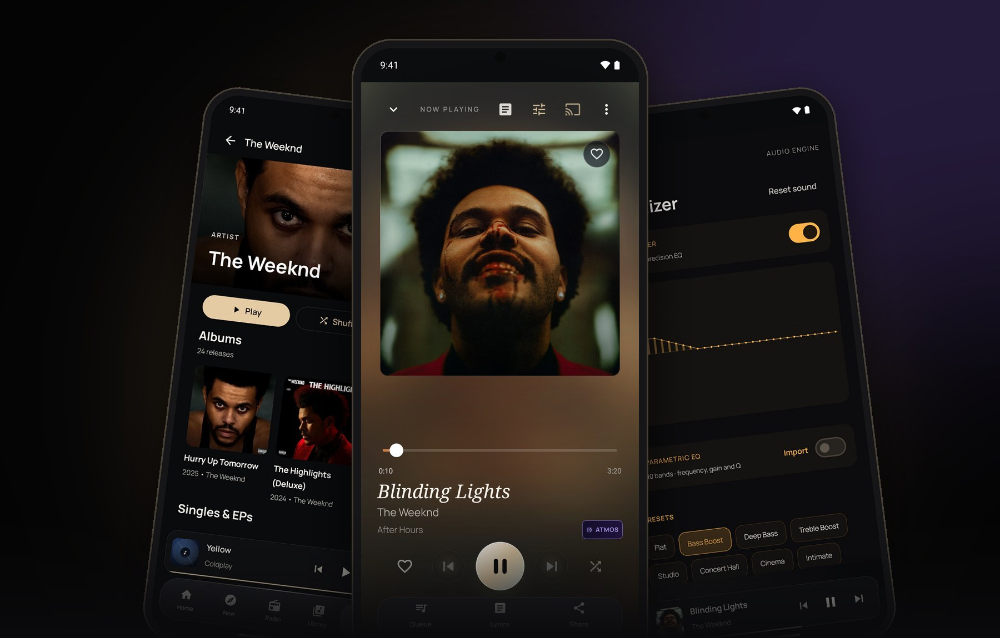
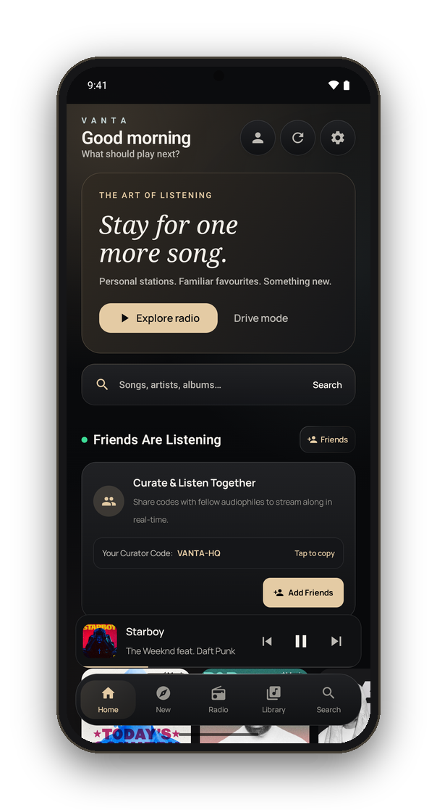
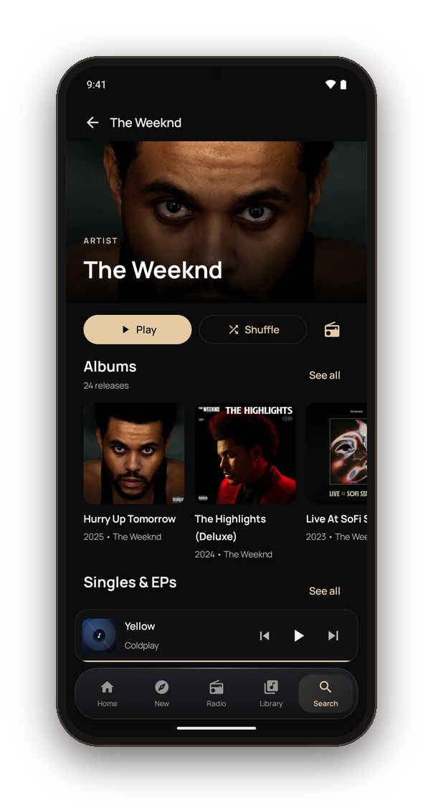
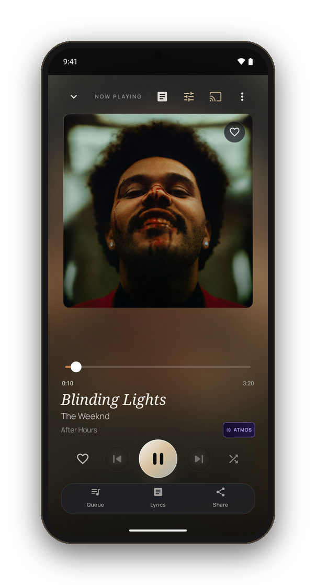
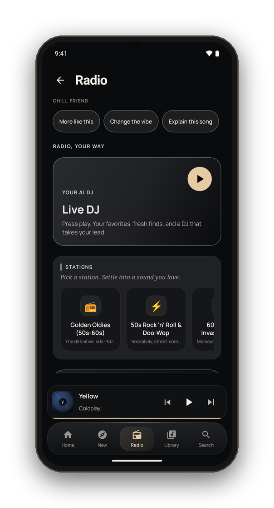
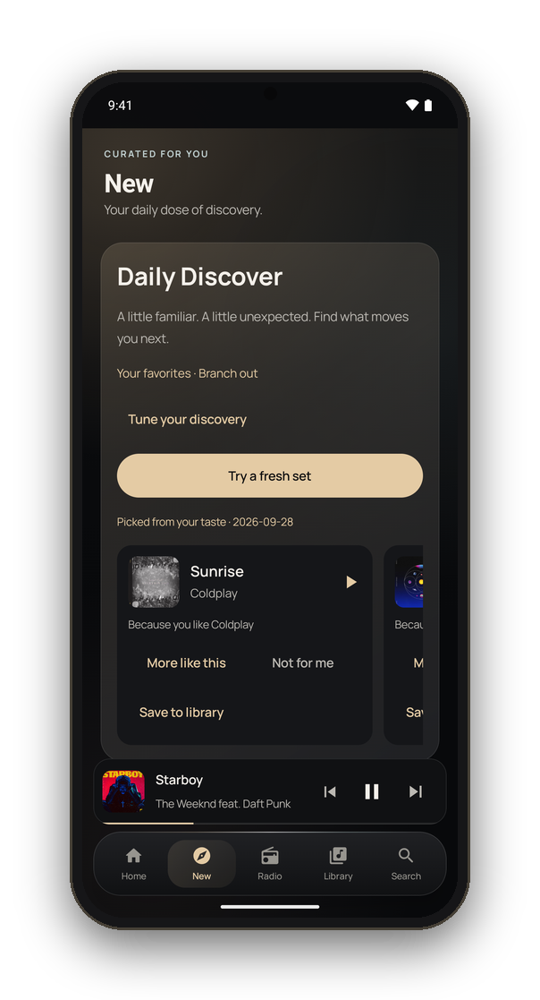
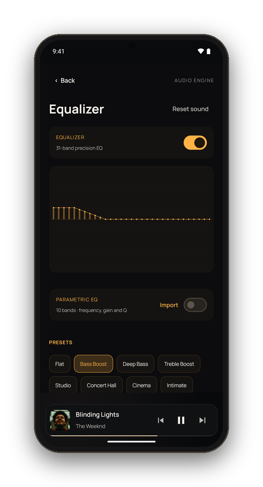
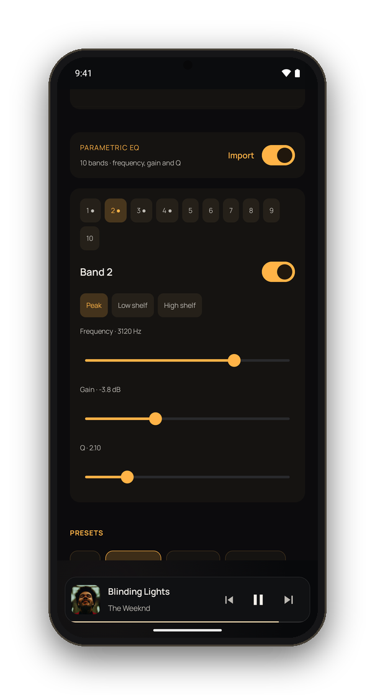
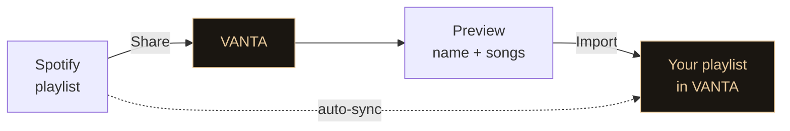

<a href="https://github.com/drewk312/VantaMusic/releases/latest">
  <picture>
    <source media="(prefers-color-scheme: dark)" srcset="./assets/banner-dark.svg" />
    <source media="(prefers-color-scheme: light)" srcset="./assets/banner-light.svg" />
    
  </picture>
</a>

**A free Android music player for people who care how their music sounds.**

[Download](#download) · [Screenshots](#screenshots) · [Sound](#sound) · [Your music](#bring-your-music) · [TV & car](#tv-and-car) · [Privacy](#privacy) · [FAQ](#faq)

 

I build VANTA on my own, in my spare time. I wanted a player that plays lossless and Dolby Atmos properly, has an EQ that actually does something, and does radio that stays on the genre you picked. So I made one. There are no ads and no tracking, and it's free.

## Download

1. Get `vanta.apk` from the **[latest release](https://github.com/drewk312/VantaMusic/releases/latest)**.
2. Open it on your phone, tablet or Android TV and tap <kbd>Install</kbd>. If Android asks, allow installs from your browser or file manager.
3. Already have VANTA? Install over it. Your library stays, and the app lets you know when there's an update.

> [!IMPORTANT]
> The only official downloads are on this repo's [Releases page](https://github.com/drewk312/VantaMusic/releases). Each release lists what changed and a SHA-256 checksum, and [SECURITY.md](SECURITY.md) shows how to check it.

## Screenshots

<table>
  <tr>
    <td align="center" width="25%"> <b>Home</b> Radio, search and friends in one place</td>
    <td align="center" width="25%"> <b>Artist pages</b> Albums, then singles and EPs</td>
    <td align="center" width="25%"> <b>Now playing</b> The badge shows what you're hearing</td>
    <td align="center" width="25%"> <b>Radio</b> Live DJ and genre stations</td>
  </tr>
  <tr>
    <td align="center"> <b>New</b> A daily mix picked from your taste</td>
    <td align="center"> <b>31-band EQ</b> Changes apply while the song plays</td>
    <td align="center"> <b>Parametric EQ</b> Import AutoEQ presets for your IEMs</td>
    <td align="center"> <b>No ads. No trackers.</b> Just music.</td>
  </tr>
</table>

## Sound

| | |
|---|---|
| **Lossless** | FLAC up to 24-bit, plus your own FLAC, ALAC and WAV files. |
| **Spatial** | Dolby Atmos and Sony 360 Reality Audio, with optional spatial audio and head tracking for headphones. |
| **EQ** | A 31-band EQ and a 10-band parametric EQ (frequency, gain and Q for each band). Import AutoEQ, Squig.link and Equalizer APO presets. |
| **Effects** | Bass Cannon, tube amp and a convolver. Every effect works on headphones, Bluetooth and USB DACs. |
| **Sound Check** | Evens out the volume between tracks. |
| **File Info** | Reads the sample rate and bit depth straight from your local files, even before you press play. The Hi-Res badge only shows when a file really is hi-res. |

## Bring your music

Share a Spotify playlist straight to VANTA. You don't need to log in.

```mermaid
flowchart LR
    A["Spotify<br/>playlist"] -->|Share| B["VANTA"]
    B --> C["Preview<br/>name + songs"]
    C -->|Import| D["Your playlist<br/>in VANTA"]
    A -.->|auto-sync| D
    style B fill:#1a1611,stroke:#E8C99B,color:#E8C99B
    style D fill:#1a1611,stroke:#E8C99B,color:#E8C99B
```

In Spotify, tap <kbd>Share</kbd> on a playlist and pick <kbd>VANTA</kbd>, or paste the link into VANTA's Imports screen.

> [!NOTE]
> Spotify only gives out the first 100 songs of a playlist through a shared link. For bigger playlists or your Liked Songs, export them as a CSV and import that instead. There's no size limit that way, and each song keeps its exact recording (ISRC).

You can also:

- Import local music from one folder or the whole phone.
- Download playlists to listen offline.
- Send a song or playlist as a link that opens right in VANTA.
- Search for anything. Typos are fine, and the original recording comes up before covers.
- Start a radio station from 147 genres and subgenres. It stays on theme, won't repeat a song within a day, and learns from your thumbs up and down.
- Read synced lyrics as the song plays.

## TV and car

VANTA runs on Android TV with a layout built for the remote, and it has a landscape mode for car and RV dash mounts.

  

  

## Privacy

- No ads, analytics or trackers.
- No microphone permission. The visualizer reacts to the audio itself.
- Every release is signed. The in-app updater checks the checksum and the signature before it installs anything.

## FAQ

<b>Is it really free?</b>

 
Yes. There are no ads, no subscription and nothing to unlock. If you want to support it, there's <a href="https://ko-fi.com/drewk312">Ko-fi</a>, but you never have to.

<b>Why isn't it on the Play Store?</b>

 
For now it's released here on GitHub. The in-app updater tells you when a new version is out, and installing it keeps your library.

<b>Does the EQ work with my USB DAC or dongle?</b>

 
Yes. The EQ and effects work on headphones, Bluetooth and USB DACs. Only the phone's built-in speaker gets a gentler profile, so it doesn't distort.

<b>How do I use my AutoEQ preset?</b>

 
Open the EQ, turn on the parametric EQ and tap <kbd>Import</kbd>. Pick the <code>ParametricEQ.txt</code> file for your headphones from AutoEQ, or an export from Squig.link or Equalizer APO.

<b>Where do I report a bug?</b>

 
On <a href="https://discord.gg/vN6ztK6m6g">Discord</a> or in <a href="https://github.com/drewk312/VantaMusic/issues">GitHub Issues</a>. Tell me your phone model, what you did and what happened. A screenshot helps a lot.

<b>Is the source code available?</b>

 
No. This repo is for downloads and news, and the app's source is private.

## Support

- Chat, bugs and ideas: [Discord](https://discord.gg/vN6ztK6m6g)
- Bug reports: [GitHub Issues](https://github.com/drewk312/VantaMusic/issues)
- Support VANTA: [ko-fi.com/drewk312](https://ko-fi.com/drewk312)

Shoutouts to **Inzo184** (`@inzo1848842`), **Ink & Echo Admin** (`@developerbios`) and **Riknar** (`@riknarr`).

## Legal

VANTA is an independent, non-commercial project. It isn't affiliated with or endorsed by Spotify, Apple, Google, Dolby, Sony, or any label, artist or streaming service; their names are only used to describe compatibility. VANTA doesn't host, store, sell or distribute music. You're responsible for how you use it and for following the terms of any service you connect. If you love an artist, support them by buying their music, streaming it officially, and going to their shows.

VANTA is provided as is, with no warranty.

Copyright © drewk312. The VANTA name, logo and branding may not be reused, and unofficial copies must not present themselves as official releases. Official releases are only published on this repository's [Releases page](https://github.com/drewk312/VantaMusic/releases). VANTA includes open-source components under their own licenses. Dolby, Dolby Atmos, Sony 360 Reality Audio, Spotify and other trademarks belong to their owners. Album art in the screenshots belongs to its owners.

 
<a href="#readme">Back to top ↑</a>

